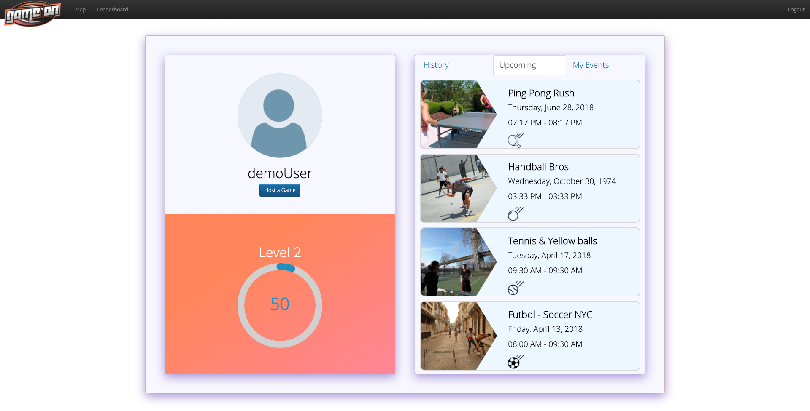

# GameOn

### Live @ [gameon-letsplay.herokuapp.com](https://gameon-letsplay.herokuapp.com/)

**GameOn** is a Full-Stack Web App that allows users to connect, play and rank in sport of their liking through a platform that enables them to find games to play wherever and whenever they want. 

Built with React.js, Node.js with Express, and PostgreSQL.

## Features

Users are able to:

* Create a new event or game with name, description, date, time and number of players.
* See near by events in the map view.
* Join an event or game to participate in it.
* At the end of each game the winning team members are awarded points.
* Only the creator of the event/game can start the game.
* The leaderboard displays the top 10 players with the most points in the app.

## Future Features

* Player roles, like captain, defender etc.
* Display a who won poll among all the players to decide winner.
* Have the leaderboard be by sport and by city.

## Technical Milestones
* Using geo-location data and calculations module to get all events happening near the user within a give radius.
* On an event page displaying an and handling the join or start game button for players that join or the owner of the event.
* Integrating user authentication with Password.js, securely storing passwords and allowing for cookie-based authorization.

## Technologies Used

* Node.js & Express.js. For the HTTP backend server.
* Passport.js. For handling user authentication and authorization.
* React.js. For the front-end/client interface of our app.
* PostgreSQL. As our relation database management system.
* pg-promise. For interfacing with our database in our backend code.
* bcrypt. For hashing and salting passwords before storage.
* CSS3. 
* Google Maps. For the map view displaying nearby games.

## Local Setup

You must have installed [Node.js](https://nodejs.org) as well as [PostgreSQL](https://www.postgresql.org/) in your computer.

You can check for these dependencies with `node -v` and `psql -v`. If your shell/terminal doesn't complain and you see version numbers you are good to go.

  1. Clone this repo and change directory to it: 

         git clone git@github.com:alejo4373/GameOn.git && cd GameOn 

  2. Install dependencies for the Node/Express Server (`backend` folder):

         cd backend && npm install

  3. Install dependencies the React App (`frontend` folder):

         cd frontend && npm install

  4. Create database and seed sample data while being in the `GameOn` directory with:

         psql -f ./backend/db/GameOnDB.sql
        > [Make sure PostgreSQL is running!](https://www.google.com/search?q=make+sure+postgres+is+running&oq=make+sure+postf&aqs=chrome.1.69i57j0l5.5280j1j7&client=ubuntu&sourceid=chrome&ie=UTF-8)

  5. To launch the Node/Express server, inside the `backend` folder run: 

          npm start

  6. To launch the React App, inside the `frontend` folder, and preferably in another terminal window run: 

          npm start

  7. A new browser tab should have been opened and the App should be running. If that is not the case check the terminals output for errors, if you are unable to troubleshoot the problem, I would be happy to address issues so open [one](/issues)
